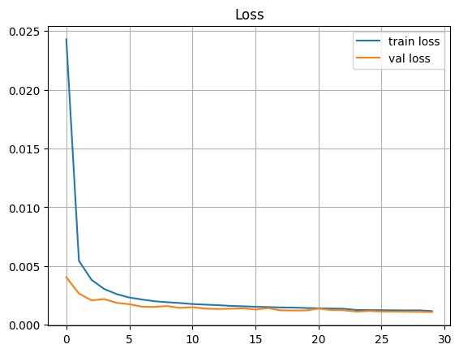
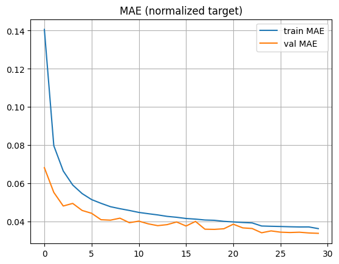
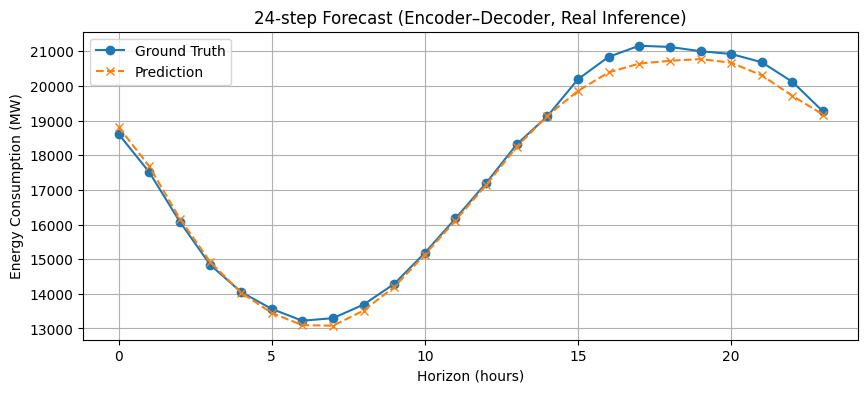

# Multi-Step Hourly Energy Consumption Forecasting with Seq2Seq Transformer

A Transformer-based encoder-decoder architecture for 24-hour ahead multi-step time series forecasting of hourly energy consumption. The model leverages multi-head self-attention to capture long-range temporal dependencies across 168-hour input sequences and employs teacher forcing during training with autoregressive decoding at inference.

---

## Results at a Glance

| Metric | Value |
|--------|-------|
| Test Loss (Huber) | 0.00118 |
| Test MAE (normalized) | 0.03638 |

The model generates coherent 24-hour forecasts that closely track actual consumption patterns, capturing daily cycles and trend dynamics with autoregressive decoding.

---

## Problem

For a given 168-hour (7-day) window of hourly energy consumption and time-based features, predict the next 24 hours of demand in megawatts (MW) for the AEP regional grid.

## Dataset

**Source**: [Hourly Energy Consumption (Kaggle)](https://www.kaggle.com/datasets/robikscube/hourly-energy-consumption) — `AEP_hourly.csv`

**Preprocessing**:
- Datetime indexing, deduplication, hourly frequency enforcement
- Missing values imputed via forward/backward fill
- Engineered features: `hour`, `dayofweek`, `month`
- Chronological split: 70% train / 15% validation / 15% test
- Features normalized via `Normalization` layer (train stats only)
- Target standardized using train mean and standard deviation

### Normalization

Features are standardized using a `tf.keras.layers.Normalization` layer adapted exclusively on the training partition. The target variable undergoes Z-score normalization:

$$y_{norm} = \frac{y - \mu_{train}}{\sigma_{train} + \epsilon}$$

where ε = 1e⁻⁶ prevents division by zero. Both μtrain and σtrain are stored for inverse transformation during evaluation and inference.

## Method

### Sequence-to-Sequence Windowing

Sliding windows of length L + H = 192 are extracted with stride 1 from the normalized data. For each window:

| Component | Shape | Description |
|-----------|-------|-------------|
| Encoder input | (168, 4) | Historical multivariate sequence |
| Decoder input | (24, 1) | Right-shifted target, zero-initialized: [0, y₁, ..., y₂₃] |
| Target output | (24, 1) | True normalized values: [y₀, y₁, ..., y₂₃] |

### Teacher Forcing

Teacher forcing is implemented by constructing the decoder input as the target sequence offset by one position. At each training step, the model predicts all H outputs in a single parallel forward pass, conditioned on the true preceding values. This approach stabilizes gradient propagation through the decoder and circumvents the vanishing-gradient problem that arises when training autoregressive models from scratch.

### Autoregressive Inference

At inference, the model operates in genuine autoregressive mode to evaluate performance under realistic conditions where future ground truth is unavailable:

1. The encoder processes the full 168-hour input sequence once.
2. Decoder input is initialized with a zero vector of length H.
3. For step t = 0, ..., H−1:
   - A forward pass generates ŷt from the current decoder state.
   - The predicted ŷt replaces position t+1 in the decoder input.
4. The complete predicted sequence is inverse-transformed to MW units.

This iterative decoding exposes the model to compounding prediction errors—a phenomenon known as exposure bias—and provides a more stringent evaluation than teacher-forced metrics alone.

## Model Architecture

| Component | Detail |
|-----------|--------|
| Architecture | Transformer Encoder-Decoder |
| d_model | 64 |
| Attention heads | 4 |
| Feed-forward dim | 128 |
| Encoder layers | 2 |
| Decoder layers | 2 |
| Positional encoding | Sinusoidal (non-learnable) |
| Parameters | 167,937 |

**Encoder**: Input projection → positional encoding → 2× (self-attention + FFN with residuals & layer norm)

**Decoder**: Input projection → positional encoding → 2× (causal self-attention + cross-attention to encoder + FFN with residuals & layer norm) → output projection

Causal masking in decoder self-attention prevents attending to future positions, preserving the autoregressive property.

## Training

| Config | Value |
|--------|-------|
| Loss | Huber (δ=1.0) |
| Optimizer | Adam (lr=1e-3) |
| LR schedule | ReduceLROnPlateau (factor=0.5, patience=5) |
| Batch size | 64 |
| Epochs | 30 |

The training and validation loss curves show a rapid initial decrease followed by smooth convergence, indicating stable optimization and effective learning of temporal patterns. The close alignment between the curves throughout training suggests that the model generalizes well without signs of overfitting.

  
<b>Figure 1:</b> Huber loss trajectories over 30 training epochs.
 

The MAE curves demonstrate consistent improvement across epochs, with validation MAE closely tracking the training MAE. The final error stabilizes at a low value, confirming strong predictive performance and reliable generalization to unseen sequences.

  
<b>Figure 2:</b> Mean Absolute Error (normalized target) over 30 training epochs.
 

## Evaluation

### Test Performance

Model performance is assessed on the held-out test set comprising 17,607 sliding windows:

| Metric | Normalized Value |
|--------|------------------|
| Huber Loss (δ = 1.0) | 0.00118 |
| Mean Absolute Error | 0.03638 |

The test MAE of 0.036 indicates that, on average, predictions deviate from ground truth by less than 4% of one standard deviation of the training target distribution. Inverse-transforming yields an interpretable error magnitude in MW units. The consistency between test and validation MAE (~0.036 vs. ~0.034–0.036) confirms stable generalization to unseen temporal ranges.

### Sample Forecast

A 24-hour autoregressive forecast from the test set shows close alignment with ground truth, capturing intra-day patterns and consumption trends with minor deviations at certain hours.

  
<b>Figure 3:</b> Autoregressive 24-hour prediction vs. observed consumption on a test sample.
 

The 24‑hour forecast plot shows that the model accurately follows the ground‑truth consumption profile, successfully capturing both the diurnal trough and peak. Predictions remain stable across the full autoregressive horizon, with only minor amplitude underestimation at peak demand, reflecting a well‑behaved and effective Transformer-based forecasting model.

## Discussion

### Architectural Considerations

The Transformer's self-attention mechanism provides a direct computational pathway between any two positions in the 168-hour input. This O(L²) pairwise connectivity enables the model to learn dependencies spanning the full week—for example, associating a Monday consumption profile with the previous Monday—without the sequential bottleneck inherent to recurrent architectures. The choice of 2 encoder and 2 decoder layers balances representational capacity against computational cost; preliminary experiments suggest that deeper configurations offer diminishing returns for this dataset size.

### Exposure Bias and Inference Strategy

A known limitation of teacher-forced training is the **exposure bias**: the model is optimized under the assumption of perfect previous-step inputs, yet at inference it receives its own (potentially erroneous) predictions. The strong 24-hour forecast in Figure 3 suggests that for this task, the bias is modest—the model's predictions are sufficiently accurate that feeding them back does not induce cascading degradation. For longer horizons (e.g., 48–72 hours), scheduled sampling or Professor Forcing could further bridge the train-inference gap.

### Feature Ablation Potential

The current feature set (raw consumption + three temporal indices) is deliberately minimal. Ablation studies could quantify the marginal contribution of each temporal feature. The sinusoidal positional encoding already provides implicit positional awareness; the explicit `hour` and `dayofweek` features may reinforce this information through a different inductive channel, potentially improving the model's discrimination between similar positions across different cycles.

### Limitations

- **Single-region training**: Performance on other grid regions or markets with different consumption profiles is untested. Transfer learning or multi-region training would be required for broader applicability.
- **Deterministic predictions**: The model outputs point forecasts without uncertainty bounds. Probabilistic extensions (e.g., quantile regression at the output layer, Monte Carlo dropout) would enable risk-aware decision-making.
- **Exogenous variables**: Weather, holidays, and economic indicators—known drivers of energy demand—are not incorporated. Their inclusion could reduce residual error, particularly around anomalous consumption events.

---
**Course:** Deep Learning    
**University:** Amirkabir University of Technology    
**Semester:** Fall 2025    
**Author:** Hadi Salavati
